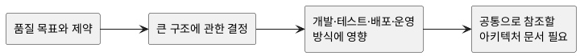
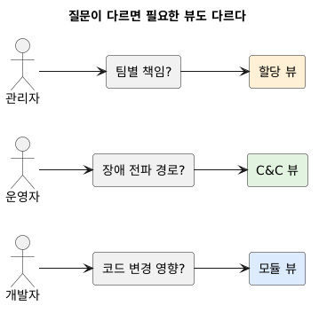
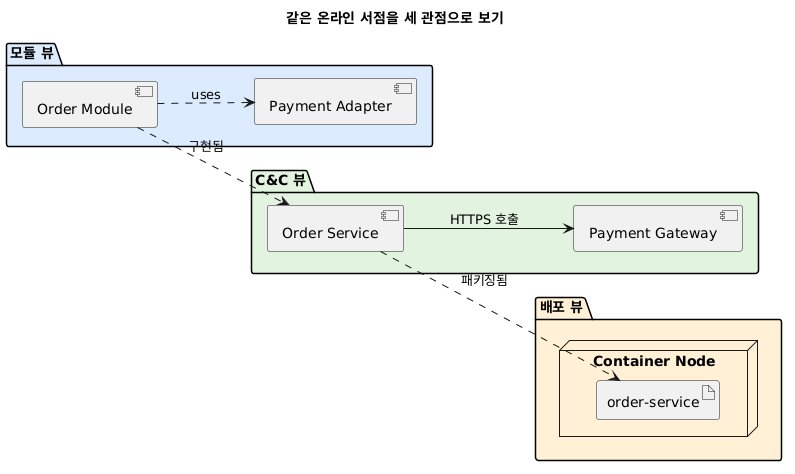
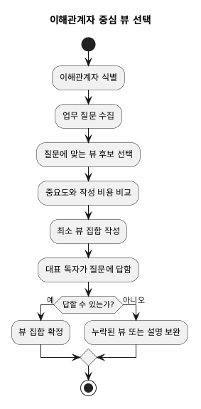
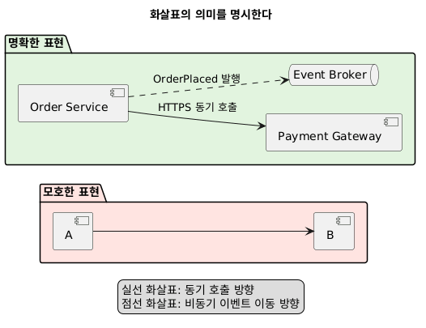
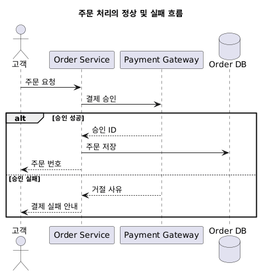
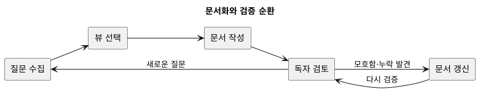

# 소프트웨어 아키텍처 문서화: 이유에서 검증까지

이 자료는 Paul Clements 외, *Documenting Software Architectures: Views and Beyond*(2002)의 핵심 개념을 SW공학 학생이 인과관계에 따라 학습할 수 있도록 다시 구성한 것이다. 원문의 장 순서를 요약하기보다, 실제 문서화 과정에서 자연스럽게 생기는 질문을 따라간다.

> **전체 흐름: 중요한 결정을 공유해야 한다 → 한 그림으로는 부족하다 → 이해관계자에 맞는 뷰를 고른다 → 구조와 동작을 명확하게 기록한다 → 뷰를 연결한다 → 독자가 사용할 수 있는지 검증한다.**

## 1. 왜 아키텍처를 문서화하는가

> **품질에 관한 결정은 시스템의 큰 구조에 영향을 준다.**

소프트웨어를 만들 때는 기능뿐 아니라 변경 용이성, 성능, 보안, 가용성 같은 품질도 결정해야 한다. 이런 품질은 특정 함수 하나만으로 달성할 수 없기 때문이다. 예를 들어 주문 처리와 알림을 동기 호출로 묶으면 구현은 단순해지지만, 알림 장애가 주문 실패로 전파될 수 있다.

> **아키텍처 결정은 여러 사람이 함께 참조할 수 있도록 문서화해야 한다.**

이처럼 이후 구현과 운영을 크게 제약하는 결정을 **아키텍처 결정**이라고 볼 수 있다. 이러한 결정은 개발·테스트·배포·운영 등 여러 사람의 업무에 영향을 주므로 머릿속이나 회의 기록에만 남겨서는 안 된다.



> **아키텍처 문서의 목적은 이해관계자가 업무에 필요한 결정을 내릴 수 있게 하는 것이다.**

그림을 많이 만드는 것 자체가 목적은 아니다. 이해관계자마다 문서를 통해 답하려는 질문은 다음과 같이 다르다.

| 이해관계자 | 질문 |
|---|---|
| 개발자 | 결제 기능을 바꾸면 어떤 코드가 영향을 받는가? |
| 테스터 | 어떤 인터페이스와 실패 경로를 검증해야 하는가? |
| 운영자 | 서버 하나가 중단되면 어떤 서비스가 영향을 받는가? |
| 보안 담당자 | 외부 입력은 어떤 신뢰 경계를 통과하는가? |
| 관리자 | 어느 팀이 어떤 부분을 책임지는가? |

## 2. 왜 하나의 그림으로는 부족한가

> **이해관계자의 질문이 다르면 필요한 구조도 다르다.**

코드 변경 질문에는 패키지와 의존성이 필요하지만, 장애 전파 질문에는 실행 중인 서비스와 통신 경로가 필요하다. 배포 위치 질문에는 서버와 네트워크가 필요하다.

> **서로 다른 관심사를 한 그림에 모두 넣지 말고 뷰(view)로 분리해야 한다.**

시스템을 하나의 거대한 그림에 모두 넣으면 서로 다른 의미의 상자와 선이 섞인다. 그림이 복잡해질 뿐 아니라, 같은 화살표가 코드 의존성인지 런타임 호출인지 알 수 없게 된다.



[PlantUML 원본](diagrams/08-why-multiple-views.puml)

### 뷰, 뷰타입, 스타일

- **뷰**: 특정 이해관계자의 관심사를 위해 실제 시스템 일부를 표현한 결과물
- **뷰타입**: 표현할 요소와 관계의 종류를 정한 범주
- **스타일**: 한 뷰타입 안에서 사용할 요소·관계·제약을 더 구체화한 규칙

> **뷰는 실제 표현이고, 뷰타입과 스타일은 그 표현을 구성하는 규칙이다.**

온라인 서점의 `Order`, `Catalog` 패키지를 그린 것은 구체적인 **뷰**다. 이 뷰가 모듈과 정적 의존성을 사용한다는 분류가 **모듈 뷰타입**이며, 상위 계층이 허용된 하위 계층만 사용하게 했다면 **계층 스타일**을 적용한 것이다.

## 3. 질문에 따라 세 가지 뷰타입을 선택한다

> **세 뷰타입은 서로 다른 질문에 답하므로 필요한 경우 함께 사용한다.**

세 뷰타입은 하나만 선택해야 하는 경쟁 관계가 아니다.

### 3.1 모듈 뷰타입: 코드는 어떻게 나뉘는가

> **모듈 뷰는 구현 단위와 정적 관계를 보여준다.**

- 요소: 패키지, 클래스, 계층, 서브시스템
- 관계: 포함(`is-part-of`), 사용(`uses`), 일반화(`is-a`)
- 답하는 질문: 책임 분리는 적절한가? 변경 영향은 어디까지인가? 어떤 코드를 재사용하는가?
- 답하기 어려운 질문: 실행 순서는 무엇인가? 어느 서버에서 실행되는가?

`Order Application ..> Payment Port : uses`는 주문 코드가 올바르게 구현되려면 결제 포트의 정의가 필요하다는 뜻이다. 실제 실행 시 네트워크로 결제사를 호출한다는 의미는 아니다.

### 3.2 컴포넌트-커넥터 뷰타입: 실행 중 어떻게 협력하는가

> **컴포넌트-커넥터(C&C) 뷰는 런타임 요소와 상호작용을 보여준다.**

- 요소: 서비스, 프로세스, 클라이언트, 데이터 저장소
- 관계: 호출, 메시지, 이벤트, 스트림, 공유 데이터 접근
- 답하는 질문: 요청과 데이터는 어디로 흐르는가? 병목과 장애는 어디로 전파되는가?
- 답하기 어려운 질문: 소스 파일은 어디에 있는가? 어느 팀이 구현하는가?

주문 서비스가 결제 게이트웨이를 호출하고 이벤트 브로커에 주문 이벤트를 발행하는 구조는 C&C 뷰로 표현한다.

### 3.3 할당 뷰타입: 소프트웨어는 환경과 어떻게 대응되는가

> **할당 뷰는 소프트웨어 요소를 소프트웨어가 아닌 환경에 대응시킨다.**

- 배포 스타일: 서비스와 서버·컨테이너의 대응
- 구현 스타일: 모듈과 저장소·디렉터리의 대응
- 작업 배정 스타일: 모듈과 개발팀의 대응
- 답하는 질문: 어디에서 실행되는가? 코드는 어디에 있는가? 누가 책임지는가?

### 같은 시스템을 세 관점으로 보기



[PlantUML 원본](diagrams/09-three-viewtypes-simple.puml)

> **서로 다른 뷰의 요소는 1:1로 대응할 필요가 없다.**

하나의 모듈로 여러 서비스 인스턴스를 만들 수 있고, 여러 모듈을 하나의 서비스로 패키징할 수도 있다.

## 4. 필요한 뷰는 이해관계자의 질문에서 결정된다

> **필요한 뷰는 이해관계자의 질문을 기준으로 선택해야 한다.**

“모든 뷰를 만들면 안전하다”는 생각은 문서 비용과 중복을 늘린다. 반대로 팀이 익숙한 다이어그램만 만들면 중요한 질문이 빠진다. 따라서 뷰 선택은 다음 인과관계를 따른다.

```text
이해관계자의 업무
    ↓
업무 중 내려야 하는 결정
    ↓
결정에 필요한 질문
    ↓
질문을 가장 잘 드러내는 뷰
```



[PlantUML 원본](diagrams/10-select-views-simple.puml)

다음 표처럼 질문과 뷰의 연결을 먼저 작성하면 불필요한 그림을 줄일 수 있다.

| 이해관계자 질문 | 필요한 정보 | 우선 뷰 |
|---|---|---|
| 결제 변경 시 어떤 코드가 바뀌는가? | 정적 의존성 | 모듈 uses 뷰 |
| 알림 장애가 주문에 전파되는가? | 런타임 호출과 이벤트 | C&C 뷰 |
| DB 장애 시 대기 노드가 있는가? | 노드와 복제 관계 | 배포 뷰 |
| 주문 기능은 어느 팀이 담당하는가? | 책임 대응 | 작업 배정 뷰 |

## 5. 선택한 뷰를 오해 없이 표현한다

> **뷰의 상자와 화살표는 의미를 명확히 정의해야 한다.**

뜻이 불분명하면 같은 표현에도 서로 다른 해석이 생긴다. `A → B`는 호출, 데이터 흐름, 코드 의존성, 배포, 제어 이전 등 여러 뜻일 수 있다.

그래서 모든 다이어그램은 다음을 명시해야 한다.

1. 상자가 나타내는 요소 타입
2. 선과 화살표가 나타내는 관계
3. 방향이 나타내는 의미
4. 색과 선 모양의 의미
5. 그림에서 의도적으로 생략한 정보



[PlantUML 원본](diagrams/11-clear-arrows-simple.puml)

> **표기법은 뷰의 목적에 필요한 차이만 명확히 드러내야 한다.**

모든 정보를 한 그림에 넣을 필요는 없다. 동기 요청과 비동기 이벤트를 구분하는 것이 목적이라면 그 차이만 명확히 표현하고, 상세 오류 코드는 인터페이스 문서로 분리한다.

## 6. 그림을 설명 자료로 완성한다

> **다이어그램은 설명 자료를 더해야 완전한 뷰가 된다.**

다이어그램은 뷰의 입구이지 전체 문서가 아니다. 그림만으로는 요소의 책임, 제약, 인터페이스, 설계 이유를 충분히 전달할 수 없다. 따라서 하나의 뷰는 다음 순서로 완성한다.

### 6.1 목적과 범위

- 대상 독자와 답하려는 질문
- 시스템 및 문서 기준 버전
- 포함 범위와 제외 범위

### 6.2 기본 표현

- PlantUML 다이어그램
- 뷰타입과 적용 스타일
- 표기법과 범례

### 6.3 요소 목록

| 요소 | 타입 | 책임 | 주요 속성 | 인터페이스 |
|---|---|---|---|---|
| Order Service | 런타임 서비스 | 주문 검증과 생성 | stateless | Order API, OrderPlaced |
| Event Broker | 메시지 커넥터 | 이벤트 전달 | at-least-once | publish, subscribe |

그림의 모든 핵심 요소는 요소 목록에서 설명되어야 한다. 목록에는 있지만 그림에서 생략한 요소가 있다면 그 이유를 기록한다.

### 6.4 컨텍스트

시스템 경계와 외부 사용자·시스템을 보여준다. 내부 구조보다 외부와 주고받는 정보와 신뢰 경계에 집중한다.

### 6.5 설계 배경

- 품질 목표와 제약
- 중요한 결정과 선택 이유
- 검토했지만 선택하지 않은 대안
- 선택으로 생긴 부정적 결과와 대응책
- 알려진 위험과 미결정 사항

> **결정 근거에는 원인과 결과를 모두 기록해야 한다.**

결과만 기록하면 조건이 변했을 때 결정을 유지해야 하는지 판단하기 어렵다.

```text
맥락: 주문 응답은 500ms 이내여야 하고 알림 장애가 주문을 막으면 안 된다.
결정: 주문 후속 처리를 비동기 이벤트로 분리한다.
긍정적 결과: 응답 지연과 장애 전파가 줄어든다.
부정적 결과: 중복 이벤트와 최종 일관성을 처리해야 한다.
대응: 멱등성 키, outbox, dead-letter queue를 사용한다.
```

## 7. 인터페이스는 제공 기능과 환경 가정을 함께 기록한다

> **인터페이스는 제공 기능과 필요한 환경을 함께 규정해야 한다.**

구조가 요소의 존재와 관계를 보여준다면, 인터페이스는 요소가 실제로 협력하기 위한 계약을 보여준다. 제공하는 API만 기록하고 필요한 환경을 생략하면 통합 실패가 발생한다.

예를 들어 주문 API가 결제 승인 전에 호출되어야 하는 초기화 절차, 요구하는 인증 토큰, 의존하는 이벤트 스키마 버전을 숨기면 호출자는 계약을 만족할 수 없다. 따라서 인터페이스에는 다음을 포함한다.

- 제공(provided) 기능과 요구(required) 자원
- 입력·출력의 타입, 범위, 단위
- 선행 조건, 후행 조건, 호출 순서
- 오류, 타임아웃, 재시도, 멱등성
- 성능과 보안 제약
- 버전과 호환성 정책

> **인터페이스 문서에는 사용자가 의존해도 되는 정보만 공개한다.**

내부 구현까지 공개하면 작은 구현 변경도 계약 변경으로 번진다.

## 8. 구조로 부족한 부분은 동작으로 보완한다

> **순서나 상태가 결과에 영향을 주면 동작 문서로 보완해야 한다.**

C&C 뷰는 어떤 요소가 연결될 수 있는지 보여주지만, 실제 메시지 순서와 조건까지 모두 보여주지는 않는다.



[PlantUML 원본](diagrams/12-behavior-simple.puml)

- 시퀀스 다이어그램: 참여자 사이의 메시지 순서와 분기
- 상태 다이어그램: 한 요소의 생명주기와 허용 전이
- 활동 다이어그램: 업무 흐름과 병렬 작업

> **동작 문서는 중요한 대표 시나리오를 우선해야 한다.**

모든 기능을 시퀀스로 그릴 필요는 없다. 품질 목표, 실패 처리, 동시성 또는 외부 연동에 영향을 주는 시나리오를 먼저 기록한다.

## 9. 여러 뷰를 연결해 하나의 시스템으로 만든다

> **변경 영향을 끝까지 추적하려면 뷰 간 매핑이 필요하다.**

각 뷰가 정확해도 서로 연결되지 않으면 모듈 변경이 어느 서비스와 서버에 영향을 주는지 알기 어렵다.

| 모듈 | 런타임 요소 | 배포 대상 | 대응 |
|---|---|---|---|
| `order.application` | Order Service | Container Platform | 1:N 복제 |
| `payment.adapter` | Order Service 내부 | Order Service와 함께 배포 | N:1 패키징 |
| `notification` | Notification Worker | Worker Node | 1:N 복제 |

이 매핑은 다음과 같은 인과 추적을 가능하게 한다.

```text
payment.adapter 변경
    ↓ 포함
Order Service 재빌드
    ↓ 배포
Container Platform의 인스턴스 교체
    ↓ 검증
결제 승인 시나리오 회귀 테스트
```

> **같은 사실은 기준 위치를 하나 정하고 다른 뷰에서 링크해야 한다.**

여러 뷰에 내용을 복사하지 않으면 변경 시 서로 다른 버전의 설명이 남는 문제를 줄일 수 있다.

## 10. 문서는 독자가 사용할 수 있을 때 완성된다

> **아키텍처 문서는 실제 독자가 자신의 질문에 답할 수 있을 때 완성된다.**

문법적으로 정확한 PlantUML과 빈칸 없는 표만으로는 충분하지 않다. 문서화는 한 번 쓰고 끝나는 작업이 아니라 작성, 사용, 검토, 갱신의 순환이다.



[PlantUML 원본](diagrams/13-documentation-loop-simple.puml)

### 검토 체크리스트

- [ ] 뷰마다 대상 독자와 답할 질문이 명시되어 있는가?
- [ ] 요소, 관계, 방향, 범례의 뜻을 추측할 필요가 없는가?
- [ ] 그림의 핵심 요소가 요소 목록에 설명되어 있는가?
- [ ] 제공 인터페이스뿐 아니라 요구 조건도 기록되어 있는가?
- [ ] 중요한 정상·실패 동작이 구조와 연결되어 있는가?
- [ ] 설계 결정에 원인, 대안, 긍정·부정 결과가 있는가?
- [ ] 모듈, 런타임, 배포 요소를 서로 추적할 수 있는가?
- [ ] 미결정 사항이 `TBD`, 담당자, 기한과 함께 표시되어 있는가?
- [ ] 문서 버전이 구현 또는 릴리스 기준과 일치하는가?
- [ ] 대표 독자가 문서만 사용해 실제 질문에 답해 보았는가?

## 11. 전체 인과관계 정리

> **아키텍처 문서화는 결정의 원인에서 독자의 검증과 지속적인 갱신까지 이어지는 과정이다.**

1. 품질 목표와 제약 때문에 시스템 전체에 영향을 주는 결정이 생긴다.
2. 이 결정을 여러 이해관계자가 사용하므로 문서화가 필요하다.
3. 이해관계자의 질문이 서로 다르므로 하나의 그림으로는 부족하다.
4. 질문에 맞춰 모듈, C&C, 할당 뷰를 선택한다.
5. 선택한 뷰의 요소와 관계를 범례로 명확히 정의한다.
6. 그림을 요소 목록, 인터페이스, 설계 근거로 보완한다.
7. 정적 구조로 설명되지 않는 순서와 조건은 동작 모델로 기록한다.
8. 뷰 간 매핑으로 코드 변경부터 배포 영향까지 추적한다.
9. 실제 독자가 질문에 답해 봄으로써 목적 적합성을 검증한다.
10. 구현과 결정이 바뀌면 기준 시점에 문서를 갱신하고 다시 검토한다.

## 12. 학습 과제

> **학습 과제는 질문에서 시작해 뷰 작성과 독자 검증까지 수행한다.**

수강신청 시스템을 대상으로 다음 순서로 수행한다.

1. 학생, 교직원, 운영자, 보안 담당자의 질문을 각 2개씩 작성한다.
2. 각 질문에 필요한 뷰를 선택하고 선택 이유를 쓴다.
3. 모듈, C&C, 배포 뷰를 간단한 PlantUML로 작성한다.
4. 각 그림에 요소 타입, 관계, 방향을 설명하는 범례를 넣는다.
5. `수강 신청 성공`과 `정원 초과` 동작을 시퀀스로 작성한다.
6. 세 뷰의 요소를 연결하는 매핑표를 만든다.
7. 중요한 설계 결정 하나의 맥락, 대안, 결과를 기록한다.
8. 다른 팀이 문서만 보고 “강의 서버 장애 시 영향”을 설명하도록 한 뒤 문서를 수정한다.

> **평가에서는 그림의 아름다움보다 질문과 뷰의 적합성, 관계 의미의 명확성, 결정과 결과의 추적성을 우선한다.**

## 참고 문헌

- Paul Clements, Felix Bachmann, Len Bass, David Garlan, James Ivers, Reed Little, Robert Nord, Judith Stafford, *Documenting Software Architectures: Views and Beyond*, Addison-Wesley, 2002.

이 문서는 위 문헌의 개념을 학습 목적으로 재구성했으며, 온라인 서점 사례와 학습 과제는 새로 작성했다.
