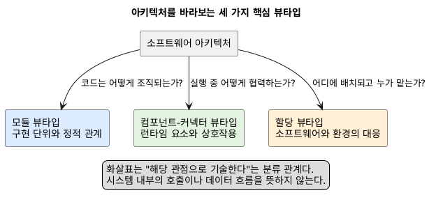
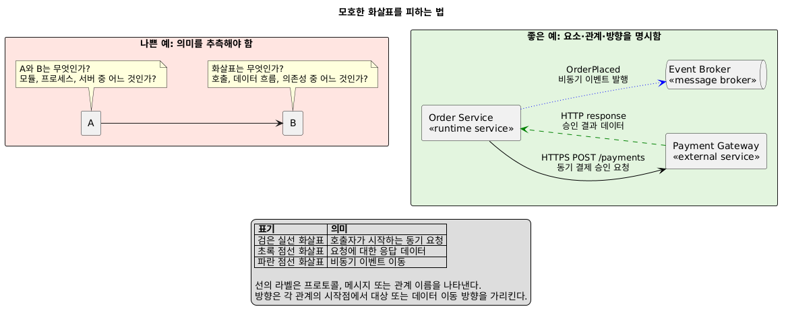
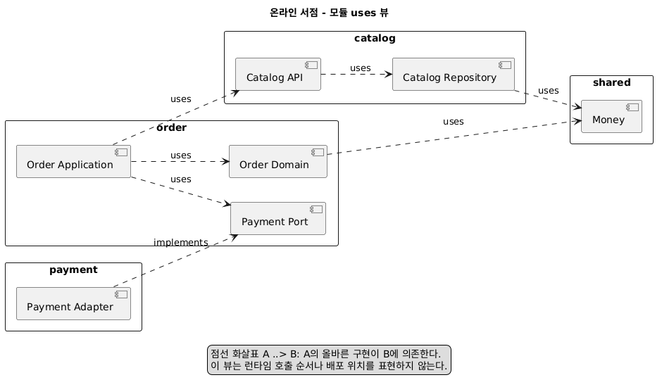
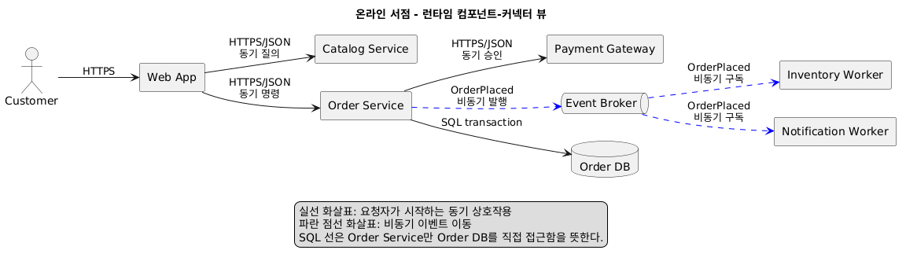
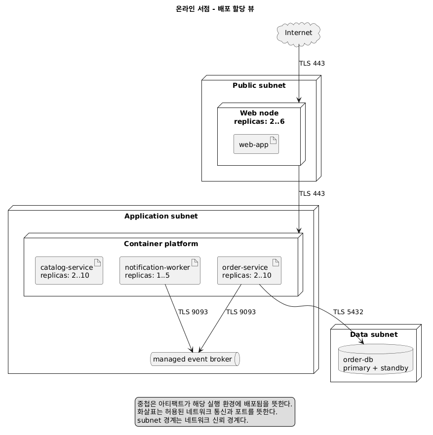
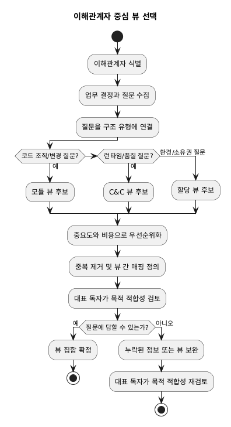
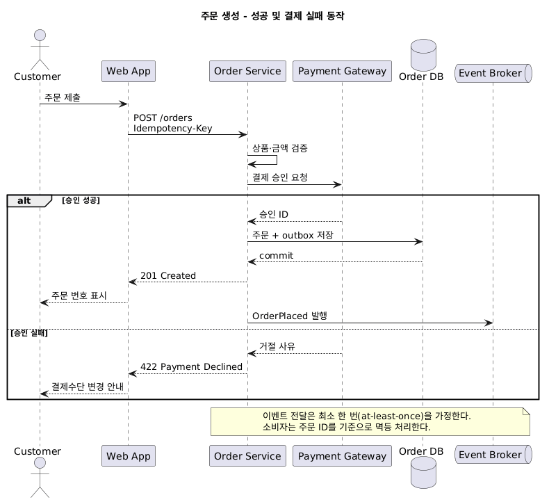

# 소프트웨어 아키텍처 문서화 학습 가이드

## 1. 학습 목표

학습을 마치면 다음을 할 수 있다.

1. 아키텍처, 뷰(view), 뷰타입(viewtype), 스타일(style)을 구분한다.
2. 모듈, 컴포넌트-커넥터(C&C), 할당 뷰타입의 질문과 한계를 설명한다.
3. 이해관계자의 관심사에 맞춰 필요한 뷰를 선택한다.
4. 다이어그램뿐 아니라 요소 목록, 인터페이스, 근거, 제약까지 문서화한다.
5. 구조로 설명되지 않는 런타임 동작을 시퀀스와 상태 모델로 보완한다.
6. 문서의 완전성, 일관성, 모호성, 최신성을 검토한다.

## 2. 먼저 알아둘 핵심 어휘

| 용어 | 의미 | 확인 질문 |
|---|---|---|
| 소프트웨어 아키텍처 | 시스템을 추론하는 데 중요한 요소, 관계, 속성의 구조 | 어떤 결정이 품질과 개발을 크게 제약하는가? |
| 뷰 | 실제 시스템의 일부 요소와 관계를 표현한 것 | 이 시스템에서 실제로 무엇이 보이는가? |
| 뷰타입 | 사용할 요소와 관계의 종류를 정의하는 범주 | 어떤 종류의 구조를 보고 있는가? |
| 스타일 | 한 뷰타입 안에서 요소·관계·제약을 특수화한 패턴 | 이 구조가 따라야 할 규칙은 무엇인가? |
| 표현(presentation) | 뷰를 보여주는 그림이나 표 | 표기법의 뜻이 명시되어 있는가? |

가장 중요한 구별은 **그림 자체가 아키텍처가 아니라는 것**이다. 상자와 선이 모듈인지 프로세스인지 서버인지, 선이 호출인지
데이터 이동인지 의존성인지 밝히지 않으면 독자는 서로 다른 시스템을 상상하게 된다.



[PlantUML 원본](diagrams/01-viewtypes.puml)

## 3. 좋은 문서화를 위한 일곱 원칙

책이 제안하는 원칙을 학습용 문장으로 정리하면 다음과 같다.

1. **작성자가 아니라 독자 관점에서 쓴다.** 각 절이 누구의 어떤 질문에 답하는지 적는다.
2. **불필요한 반복을 피한다.** 한 사실의 기준 위치를 정하고 다른 곳에서는 링크로 참조한다.
3. **의도하지 않은 모호성을 없앤다.** 범례, 관계 방향, 요소 타입, 생략 기준을 설명한다.
4. **표준 구조를 사용한다.** 모든 뷰가 같은 순서와 항목을 가지면 찾기 쉽고 누락도 드러난다.
5. **설계 근거를 기록한다.** 선택 결과뿐 아니라 제약, 대안, 트레이드오프를 남긴다.
6. **최신 상태를 유지하되 매 순간 갱신하지는 않는다.** 기준 버전과 갱신 시점을 정한다.
7. **목적 적합성을 검토한다.** 실제 독자가 자신의 업무 질문에 답할 수 있는지 확인한다.

### 모호한 화살표를 피하는 법

`A --> B`만 그려 놓고 “A가 B와 연결된다”고 쓰면 정보가 부족하다. 다음을 함께 정의한다.



[PlantUML 원본](diagrams/07-avoid-ambiguous-arrows.puml)

- 관계 이름: 호출, 사용, 발행, 배포 등
- 방향의 의미: 제어, 데이터, 의존성 중 무엇인가
- 허용 조건: 동기/비동기, 다중성, 실패와 시간 제한
- 범례: 색, 선, 화살촉의 의미

PlantUML도 자동으로 의미를 부여하지 않는다. 다이어그램의 제목, 라벨, 범례가 의미를 만든다.

## 4. 세 가지 핵심 뷰타입

### 4.1 모듈 뷰타입: 코드는 어떻게 조직되는가?

모듈은 구현 단위에 책임을 부여한 정적 요소다. 런타임 인스턴스나 실제 통신을 직접 보여주지는 않는다.

| 항목 | 내용 |
|---|---|
| 대표 요소 | 패키지, 클래스, 서브시스템, 계층 |
| 대표 관계 | is-part-of, depends-on/uses, is-a |
| 유용한 질문 | 변경 영향은 어디까지인가? 누가 구현하는가? 재사용 단위는 무엇인가? |
| 잘 답하지 못하는 질문 | 실행 중 메시지 순서, 동시성, 실제 배포 위치 |

대표 스타일은 다음과 같다.

- 분해(decomposition): 큰 책임을 작은 책임으로 나누며 `is-part-of`를 표현한다.
- 사용(uses): 한 모듈이 올바르게 동작하기 위해 다른 모듈의 존재를 필요로 하는 관계다.
- 일반화(generalization): 상위 타입과 특수 타입의 `is-a` 관계다.
- 계층(layered): 상위 계층이 허용된 하위 계층의 서비스를 사용하도록 제한한다.



[PlantUML 원본](diagrams/02-module-view.puml)

온라인 서점 모듈 뷰는 변경 책임을 `catalog`, `order`, `payment`, `shared`로 나눈다.
이 그림에서 화살표는 **컴파일 또는 구현 의존성**이지 런타임 호출을 뜻하지 않는다.

> 주의: layer는 코드의 허용된 사용 관계를 제한하는 모듈 스타일이고, tier는 실행 환경의 물리적 분리를 흔히 가리킨다.
> “3-layer”와 “3-tier”는 같은 말이 아니다.

### 4.2 컴포넌트-커넥터 뷰타입: 실행 중 무엇이 상호작용하는가?

C&C 뷰는 런타임 요소와 상호작용 경로를 나타낸다. 하나의 코드 모듈에서 여러 런타임 컴포넌트가 생길 수 있고, 여러 모듈이
하나의 컴포넌트에 함께 포함될 수도 있다.

| 항목 | 내용 |
|---|---|
| 대표 요소 | 서비스, 프로세스, 클라이언트, 데이터 저장소 |
| 대표 커넥터 | 호출, 메시지, 이벤트 버스, 스트림, 공유 데이터 접근 |
| 유용한 질문 | 런타임 데이터는 어디로 흐르는가? 장애가 어디로 전파되는가? 병목은 어디인가? |
| 잘 답하지 못하는 질문 | 소스 트리 구조, 개발팀 책임, 설치 파일 위치 |

대표 스타일에는 데이터 스트림, 호출-반환(클라이언트-서버·P2P), 공유 데이터, 발행-구독, 통신 프로세스가 있다.



[PlantUML 원본](diagrams/03-runtime-view.puml)

온라인 서점 C&C 뷰는 동기 HTTPS 호출과 비동기 이벤트를 다른 선으로 구별한다. 주문 서비스가
`OrderPlaced`를 발행하면 알림과 재고 컴포넌트가 독립적으로 구독한다. 이 구조는 소비자 추가에는 유리하지만, 이벤트 순서와
중복 처리 정책을 별도로 문서화해야 한다.

### 4.3 할당 뷰타입: 소프트웨어는 환경에 어떻게 대응되는가?

할당 뷰는 소프트웨어 요소와 소프트웨어가 아닌 환경 사이의 `allocated-to` 관계를 보여준다.

| 스타일 | 소프트웨어 쪽 | 환경 쪽 | 답하는 질문 |
|---|---|---|---|
| 배포 | 프로세스·서비스·아티팩트 | 노드·네트워크·실행 환경 | 어디서 실행되는가? |
| 구현 | 모듈·아티팩트 | 디렉터리·저장소·빌드 단위 | 코드가 어디에 있는가? |
| 작업 배정 | 모듈·기능 | 팀·개발자 | 누가 책임지는가? |



[PlantUML 원본](diagrams/04-deployment-view.puml)

온라인 서점 배포 뷰는 인터넷, 애플리케이션 서브넷, 데이터 서브넷이라는 신뢰 경계와 서비스
복제 수를 보여준다. 동적 스케일링을 사용하는 실제 시스템이라면 “인스턴스 2개” 같은 숫자를 고정값이 아니라 `2..10`처럼
범위와 정책으로 문서화해야 한다.

## 5. 뷰 사이를 연결하기

서로 다른 뷰에서 이름이 같다고 자동으로 같은 요소는 아니다. 명시적인 대응표가 필요하다.

| 모듈 | 런타임 컴포넌트 | 배포 대상 | 대응 형태 |
|---|---|---|---|
| `order.application` | Order Service | app subnet의 컨테이너 | 1:N(복제) |
| `catalog` | Catalog Service | app subnet의 컨테이너 | 1:N(복제) |
| `payment.adapter` | Order Service 내부 어댑터 | Order Service와 함께 배포 | N:1 |
| `notification` | Notification Worker | worker node | 1:N |

대응은 1:1만 있는 것이 아니다. 한 모듈이 여러 프로세스에 포함되거나, 여러 모듈이 한 프로세스로 패키징될 수 있다. 이 매핑이
없으면 소스 변경이 어떤 런타임·배포 요소에 영향을 주는지 추적하기 어렵다.

## 6. 어떤 뷰를 선택할 것인가

모든 가능한 뷰를 만드는 것이 목표가 아니다. 이해관계자가 중요한 결정을 내리는 데 필요한 최소 집합을 선택한다.

1. 이해관계자를 나열한다: 개발자, 운영자, 보안 담당자, 테스터, 프로젝트 관리자 등.
2. 각자가 문서로 답해야 할 질문을 수집한다.
3. 질문을 가장 잘 드러내는 뷰와 스타일에 연결한다.
4. 중요도와 변경 비용을 고려해 우선순위를 매긴다.
5. 중복 뷰는 결합하거나 제거하되 서로 다른 의미를 한 그림에 억지로 섞지 않는다.

| 이해관계자 질문 | 우선 뷰 | 보완 자료 |
|---|---|---|
| 결제 기능 변경 시 어떤 코드가 영향받는가? | 모듈 uses | 인터페이스, 결정 근거 |
| 주문 요청 지연의 원인은 어디인가? | C&C | 시퀀스, 성능 속성 |
| 한 노드가 죽으면 서비스가 계속되는가? | 배포 | 장애 시나리오, 복구 정책 |
| 신규 팀에 어떤 책임을 넘길 것인가? | 작업 배정 | 모듈 분해 |
| 외부 결제사가 지켜야 할 계약은 무엇인가? | C&C/컨텍스트 | 인터페이스 명세 |



[PlantUML 원본](diagrams/05-view-selection.puml)

뷰 선택 흐름은 “익숙한 그림부터”가 아니라 “질문부터” 시작하는 과정을 표현한다.

## 7. 하나의 뷰를 문서화하는 표준 템플릿

다이어그램만 제출하면 문서화가 끝난 것이 아니다. 각 뷰를 다음 형식으로 작성한다.

### 7.1 뷰 메타데이터

- 이름, 목적, 대상 독자
- 기준 시스템/문서 버전과 갱신일
- 포함 범위와 의도적으로 제외한 범위

### 7.2 기본 표현(primary presentation)

- 핵심 요소와 관계를 한눈에 보여주는 PlantUML 그림
- 뷰타입과 스타일
- 범례 및 표기법의 정확한 의미

### 7.3 요소 목록(element catalog)

| 요소 | 타입 | 책임 | 핵심 속성 | 인터페이스 |
|---|---|---|---|---|
| Order Service | 런타임 서비스 | 주문 검증·생성 | stateless, 2..10 replicas | Order API, events |
| Event Broker | 커넥터/인프라 | 이벤트 전달 | at-least-once | publish, subscribe |

그림에 있는 모든 요소와 관계는 목록에서 찾을 수 있어야 한다. 반대로 목록의 핵심 요소가 그림에서 빠졌다면 생략 이유를 쓴다.

### 7.4 컨텍스트 다이어그램

시스템 경계, 외부 행위자·시스템, 입출력 인터페이스를 표현한다. 내부 구조를 깊게 그리기보다 “우리 시스템이 무엇과 만나는가”에
집중한다.

### 7.5 변형과 동적 변화

- 선택 가능한 기능, 배포 구성, 플러그인 지점
- 생성·삭제·이동·복제되는 런타임 요소
- 허용 범위와 변화가 일어나는 조건

### 7.6 아키텍처 배경

- 가정과 제약
- 품질 속성 목표
- 중요한 설계 결정과 근거
- 검토한 대안과 기각 이유
- 알려진 위험과 기술 부채

### 7.7 관련 뷰와 추적성

- 다른 뷰 요소와의 1:1, 1:N, N:M 대응
- 요구사항·결정 기록(ADR)·인터페이스 문서 링크

## 8. 인터페이스 문서화

인터페이스는 요소가 환경과 상호작용하는 방식이다. 제공 기능만이 아니라 요소가 환경에 **요구하는 조건과 가정**도 포함한다.
사용자가 의존해도 되는 정보만 공개해야 한다. 너무 적으면 통합에 실패하고, 너무 많으면 구현 변경이 인터페이스 변경이 된다.

다음 항목을 확인한다.

- 인터페이스 식별자, 버전, 목적
- 제공(provided) 자원과 요구(required) 자원
- 입력·출력 타입, 단위, 허용 범위
- 호출 순서, 선행 조건, 후행 조건, 불변식
- 오류, 예외, 타임아웃, 재시도, 멱등성
- 동시성, 처리량, 지연 등 품질 속성
- 접근 제어, 인증, 감사 조건
- 호환성과 폐기 정책

예: `POST /orders`가 `201`을 반환한다는 구문 정보만으로는 부족하다. 같은 멱등성 키를 재사용했을 때의 의미, 결제 승인 실패,
응답 시간 한도, 이벤트 발행의 원자성까지 통합 당사자가 의존한다면 계약에 포함해야 한다.

## 9. 구조를 넘어 동작 문서화하기

정적 구조는 가능한 연결을 보여주지만 실제 상호작용 순서, 조건, 반복, 시간 제약은 충분히 설명하지 못한다. 중요한 시나리오에는
동작 모델을 추가한다.



[PlantUML 원본](diagrams/06-order-sequence.puml)

주문 생성 시퀀스는 성공과 결제 실패 경로를 함께 보여준다. 구조 뷰와 달리 “누가 먼저 무엇을
호출하는지”, “실패 시 어떤 응답을 반환하는지”가 핵심이다.

동작 모델을 선택하는 기준은 다음과 같다.

- 시퀀스 다이어그램: 한 시나리오의 메시지 순서와 분기
- 상태 다이어그램: 한 요소의 수명주기와 허용 전이
- 활동 다이어그램: 작업 흐름, 병렬 처리, 의사결정
- 표/의사코드: 예외 규칙이나 정밀한 조건이 그림보다 명확할 때

## 10. 설계 근거를 남기는 간단한 형식

```text
결정: 주문 후속 처리를 발행-구독 방식으로 분리한다.
상태: 승인됨
맥락: 주문 응답은 500ms 이내여야 하며 알림 장애가 주문 생성을 막으면 안 된다.
대안: (1) 주문 서비스가 모든 후속 서비스를 동기 호출, (2) 공유 DB 폴링.
선택 이유: 소비자 독립성과 장애 격리를 얻는다.
부정적 결과: 최종 일관성, 중복 이벤트, 관찰 가능성 비용이 생긴다.
대응: 멱등성 키, outbox, correlation ID, dead-letter queue를 사용한다.
재검토 조건: 강한 일관성이 필요한 규제 요구가 도입될 때.
```

“확장성이 좋아서”처럼 추상적인 근거는 검증하기 어렵다. 어떤 시나리오와 수치가 결정에 영향을 주었는지 기록한다.

## 11. 문서 검토 체크리스트

### 내용

- [ ] 뷰의 이해관계자와 질문이 명시되어 있다.
- [ ] 요소, 관계, 속성의 의미와 범례가 있다.
- [ ] 그림의 모든 핵심 요소가 요소 목록에 설명되어 있다.
- [ ] 시스템 경계와 외부 의존성이 보인다.
- [ ] 인터페이스의 제공·요구 사항이 모두 기록되어 있다.
- [ ] 중요한 동작, 실패, 동적 변화가 설명되어 있다.
- [ ] 주요 결정에 제약, 대안, 결과가 연결되어 있다.
- [ ] 뷰 사이 대응 관계가 추적 가능하다.

### 품질

- [ ] 같은 용어가 문서 전체에서 같은 뜻으로 쓰인다.
- [ ] 화살표와 색의 의미를 추측할 필요가 없다.
- [ ] 중복 정보는 기준 위치를 가리킨다.
- [ ] 미결정 사항은 빈칸 대신 `TBD`와 담당자/기한으로 표시한다.
- [ ] 문서 버전이 구현 또는 릴리스 기준과 일치한다.
- [ ] 실제 독자가 문서만 보고 대표 업무 질문에 답해 보았다.

## 12. 4주 학습 계획

| 주차 | 학습 | 실습 결과물 |
|---|---|---|
| 1주 | 핵심 용어, 일곱 원칙, 모듈 뷰 | 모듈 분해·uses 다이어그램 |
| 2주 | C&C 스타일, 런타임 동작 | 런타임 뷰·시퀀스 다이어그램 |
| 3주 | 할당 뷰, 뷰 선택과 매핑 | 배포 뷰·뷰 대응표 |
| 4주 | 인터페이스, 근거, 검토 | 완성 문서 패키지·동료 검토표 |

각 주차에 “그림 그리기 → 요소 목록 작성 → 모호성 찾기 → 다른 학생이 질문에 답하기” 순서로 실습한다.

## 13. 연습문제

### 개념 확인

1. 뷰와 뷰타입의 차이를 온라인 서점 예제로 설명하라.
2. 모듈 uses 관계와 C&C 호출 관계가 다른 이유는 무엇인가?
3. 계층(layer)과 티어(tier)를 각각 어떤 뷰타입으로 표현하는 것이 자연스러운가?
4. 배포 뷰만으로 소스 코드 변경 영향을 판단하기 어려운 이유는 무엇인가?
5. 인터페이스의 required 부분을 생략했을 때 생길 수 있는 실패를 하나 제시하라.

### 적용

6. 학교 수강신청 시스템의 이해관계자 4명과 각자의 핵심 질문을 적고 필요한 뷰를 선택하라.
7. `수강 신청 성공`, `정원 초과`, `선수 과목 미충족` 경로를 PlantUML 시퀀스로 작성하라.
8. “DB를 관계형 DB로 선택했다”는 결정을 위의 근거 형식으로 작성하라.
9. 하나의 모듈이 세 개의 런타임 인스턴스에 대응되는 예를 만들고 매핑표로 표현하라.
10. 범례가 없는 상자-화살표 그림을 동료와 교환하고, 서로 다르게 해석한 부분을 찾아 수정하라.

### 종합 과제

팀별로 작은 시스템을 골라 다음 패키지를 제출한다.

- 이해관계자-질문-뷰 선택표
- 모듈, C&C, 배포 뷰 각 1개(PlantUML)
- 뷰별 요소 목록과 범례
- 대표 시나리오 2개(정상 1, 실패 1)
- 핵심 인터페이스 명세 1개
- 설계 결정과 근거 2개
- 뷰 간 매핑표
- 다른 팀의 목적 적합성 검토 결과

## 14. 해설 요점

1. 뷰타입은 모듈 같은 표현 범주이고, 뷰는 온라인 서점의 실제 `order`, `catalog` 모듈을 담은 구체 표현이다.
2. uses는 구현의 정확성을 위한 정적 의존성이고 호출은 실행 중 제어·데이터 상호작용이다. 항상 일치하지 않는다.
3. layer는 모듈 뷰, tier는 보통 배포 할당 뷰가 자연스럽다.
4. 배포 뷰에는 코드 책임과 정적 의존성이 충분히 나타나지 않기 때문이다.
5. 예를 들어 초기화 호출, 특정 DB 스키마, 인증 토큰 같은 환경 가정이 충족되지 않아 런타임 통합이 실패할 수 있다.

6~10번은 단일 정답보다 **질문과 뷰의 적합성**, **표기 의미의 명시**, **결정과 품질 목표의 추적성**을 평가한다.

## 15. PlantUML 렌더링

PlantUML이 설치되어 있다면 다음과 같이 SVG를 만들 수 있다.

```bash
plantuml -tsvg diagrams/*.puml
```

VS Code PlantUML 확장이나 PlantUML 서버에서도 각 파일을 열어 렌더링할 수 있다. 다이어그램을 수정할 때는 그림뿐 아니라 이
문서의 요소 목록, 매핑, 근거도 함께 바뀌어야 하는지 확인한다.

## 참고 문헌

- Paul Clements, Felix Bachmann, Len Bass, David Garlan, James Ivers, Reed Little, Robert Nord, Judith Stafford,
  *Documenting Software Architectures: Views and Beyond*, Addison-Wesley, 2002.
- 사용자 제공 PDF: <https://theswissbay.ch/pdf/Gentoomen%20Library/Software%20Engineering/Addison-Wesley%20-%202002%20-%20Documenting%20Software%20Architectures%2C%20Views%20and%20Beyond%20-%20ISBN%200201703726%20-%20342s.pdf>

이 자료의 용어와 큰 분류는 위 문헌을 따르며, 온라인 서점 사례와 문제·해설은 학습을 위해 새로 구성했다.
